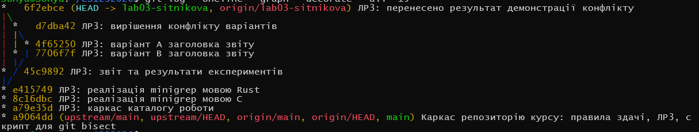

# ЛР 3. Сітнікова, КІ-31

## Середовище

Робота виконувалась у Linux (WSL2).

- GCC: 15.2.0
- GNU Make: 4.4.1
- Git: 2.53.0
- rustc: 1.98.1
- cargo: 1.98.1

## 1. Git: гілки та посилання

Після створення гілки `lab03-sitnikova` команда `cat .git/HEAD` показала:

`ref: refs/heads/lab03-sitnikova`

І файл `.git/refs/heads/lab03-sitnikova` містив хеш коміту:

`a9064dd61ac575b6dd405c683daff66ab7964bf6`

Отже, файл `.git/HEAD` містить посилання на поточну гілку, а файл у `.git/refs/heads/` містить хеш коміту, на який ця гілка вказує. І, таким чином, гілка в Git фактично є вказівником на якийсь коміт, а `HEAD` визначає поточну гілку.

## 2. C та Valgrind

Для перевірки роботи з пам'яттю я тимчасово видалила `free(line)` та запустила програму через Valgrind.

Valgrind показав:

`in use at exit: 120 bytes in 1 blocks`

`definitely lost: 120 bytes in 1 blocks`

Після видалення `free(line)` виник витік пам'яті. Пам'ять була виділена функцією `getline()` для буфера `line`, але не була звільнена перед завершенням програми. Тому після повернення `free(line)` цей буфер знову звільняється коректно.

## 3. Робота Makefile

Після першого запуску `make` програма була скомпільована. Під час повторного запуску без змін було отримано:

`make: Nothing to be done for 'all'.`

Після виконання `touch minigrep.c` команда `make` знову виконала компіляцію.

Це відбувається тому, що `make` аналізує залежності та час останньої модифікації файлів. І якщо цільовий файл `minigrep` новіший за `minigrep.c`, то повторна збірка не потрібна. Після `touch minigrep.c` час модифікації вихідного файлу оновлюється, і тому `make` виконує повторну збірку.

## 4. Перевірка безпеки пам'яті в Rust

Для експерименту я додала функцію:

```rust
fn bad() -> &String {
    let s = String::from("x");
    &s
}
```

Компілятор видав помилку:
```
error[E0106]: missing lifetime specifier
  --> src/main.rs:43:13
   |
43 | fn bad() -> &String {
   |             ^ expected named lifetime parameter
   |
   = help: this function's return type contains a borrowed value, but there is no value for it to be borrowed from
help: consider using the 'static lifetime, but this is uncommon unless you're returning a borrowed value from a const or a static
   |
43 | fn bad() -> &'static String {
   |              +++++++
help: instead, you are more likely to want to return an owned value
   |
43 - fn bad() -> &String {
43 + fn bad() -> String {
   |

For more information about this error, try rustc --explain E0106.
error: could not compile minigrep (bin "minigrep") due to 1 previous error
```

Функція намагається повернути посилання на локальну змінну `s`, яка після завершення функції вже не існуватиме. Rust виявляє таку помилку ще під час компіляції. Після перевірки функцію `bad()` було видалено.

## 5. Порівняння C та Rust

|         Показник         |    C    |   Rust  |
|--------------------------|--------:|--------:|
| Кількість рядків         | 36      | 41      |
| Перша чиста збірка       | 0.155 с | 0.490 с |
| Повторна збірка без змін | 0.003 с | 0.029 с |
| Debug-бінарник           | 20 KB   | 4.6 MB  |
| Release-бінарник         | 17 KB   | 462 KB  |

У моїх вимірюваннях Rust збирався довше і його бінарний файл був більшим. Після Release-збірки розмір Rust-програми зменшився з 4.6 MB до 462 KB, але все одно залишився більшим за C-версію (17 KB).

## 6. Конфлікт злиття та синхронізація

Для створення конфлікту я створила гілки `variant-a` та `variant-b` і змінила в них один і той самий рядок `REPORT.md` по-різному. Під час `git merge variant-a` Git повідомив про конфлікт. Я вручну залишила потрібний варіант, додала файл через `git add` і створила merge-коміт.

Звичайний коміт має одного батька, а merge-коміт у цьому випадку має двох, оскільки поєднує дві гілки історії. Git не зміг автоматично вирішити конфлікт, тому що в обох гілках один і той самий рядок був змінений по-різному. Обидва варіанти були синтаксично правильними, тому Git не зміг визначити, який із них є правильним за змістом.

Граф історії з merge-комітом:



Після цього виконала:

`git fetch upstream`

`git rebase upstream/main`

Git повідомив `Current branch lab03-sitnikova is up to date`, тому переносити нові зміни з `upstream/main` не знадобилося.

## 7. Пошук зламаного коміту через git bisect

У навчальному репозиторії було 30 комітів. Під час ручного пошуку через `git bisect` мені знадобилося 5 перевірок. `git bisect run` також виконав 5 перевірок.

`log2(30) ≈ 4.91`, тому отримані 5 перевірок відповідають очікуваній кількості кроків двійкового пошуку.

Перший зламаний коміт:

`0857d571ef00d002c43a3cc908c66235de68396b`

Повідомлення:

`оптимізовано цикл підсумовування`

У цьому коміті рядок

```c
for (int i = 1; i < argc; i++)
```

було замінено на

```c
for (int i = 1; i <= argc; i++)
```

Через `<=` цикл виконує одну зайву ітерацію і доходить до `argv[argc]`.

## 8. Атомарні коміти та git bisect

Якщо один коміт містить зміни одразу для п'яти різних задач, `git bisect` зможе визначити лише цей коміт як той, у якому з'явилася помилка, але не покаже, яка саме зі змін її спричинила. І тому краще робити атомарні коміти, де один коміт містить одну логічну зміну. У такому випадку знайдений через `git bisect` коміт точніше вказує на причину помилки.

## Контрольні питання

### 1. Чому `getline()` сама виділяє буфер?

`getline()` може сама виділяти та за потреби збільшувати буфер під фактичну довжину рядка. І завдяки цьому не потрібно наперед задавати фіксований розмір масиву і зменшується ризик переповнення буфера через занадто довгий рядок.

### 2. Що буде з дуже довгим рядком?

Моя C-версія з `getline()` зможе прочитати рядок довжиною в мільйон символів, якщо вистачить пам'яті, оскільки буфер може збільшуватися. А варіант із `char buf[256]` та `fgets()` прочитає такий рядок лише частинами по декілька викликів.

### 3. Коли Rust звільняє пам'ять без `free()`?

Змінна `content` типу `String` володіє пам'яттю з вмістом файлу і коли вона виходить зі своєї області видимості наприкінці `main`, тоді Rust автоматично викликає її деструктор (`Drop`) і звільняє пам'ять.

### 4. Від якої помилки Rust не захищає?

Rust не захищає, наприклад, від логічної помилки в алгоритмі, коли програміст написав неправильну умову або формулу. Borrow checker перевіряє правила роботи з пам'яттю та посиланнями, а не правильність самого алгоритму.

### 5. Чому повторний `cargo build` працює майже миттєво?

Cargo не компілює повторно те, що не змінилося. Cargo знає структуру Rust-проєкту, його залежності і сам керує процесом збірки.

### 6. Коли порівняння часу модифікації у `make` може дати неправильний результат?

Наприклад, якщо час файлу був змінений вручну чи системний годинник має неправильний час, тоді `make` може помилково вирішити, що залежність не змінювалася і не перебудувати потрібний файл.

### 7. Чим `git merge` відрізняється від `git rebase`?

`merge` об'єднує дві гілки і зберігає їхню історію, може створити merge-коміт із двома батьками, а `rebase` переносить коміти однієї гілки на іншу та переписує їхню історію. Тому робити rebase вже опублікованих комітів небезпечно: їхні хеші змінюються, що може створити проблеми іншим учасникам.

### 8. Чому створення гілки Git відбувається миттєво?

Гілка Git не є копією всього проєкту, це вказівник на певний коміт, тому для створення нової гілки Git достатньо створити нове посилання на коміт.

### 9. Чому `git bisect run` використовує код завершення?

`git bisect run` повинен автоматично визначити чи пройшов тест чи ні. І для цього він використовує код завершення програми: `0` означає успішну перевірку, а ненульовий код — помилку. Просто надрукований текст Git сам інтерпретувати не може.

### 10. Чому видалений наступним комітом пароль усе одно скомпрометований?

Тому що попередній коміт із паролем залишається в історії Git, його можна відкрити та побачити старий вміст файлу, тому такий пароль потрібно вважати скомпрометованим і замінити.

### 11. Чи означає відсутність merge-конфлікту, що результат правильний?

Ні, не означає, Git перевіряє можливість текстового об'єднання, а не логіку програми. Один розробник, наприклад, може змінити формулу обчислення в одному рядку, а інший — код, який використовує її результат, в іншому. Git об'єднає рядки без конфлікту, але разом зміни можуть працювати неправильно.

### 12. Що станеться, якщо результат `malloc()` не перевірити на `NULL`?

Якщо пам'яті недостатньо, `malloc()` може повернути `NULL`, і якщо програма потім спробує використати цей вказівник як звичайну адресу пам'яті, її поведінка буде некоректною і програма може аварійно завершитися.

## Висновок

Під час лабораторної роботи я реалізувала одну утиліту двома мовами (C та Rust) і порівняла особливості їхньої збірки та роботи з пам'яттю. На практиці перевірила витік пам'яті у C за допомогою Valgrind та побачила, як Rust виявляє небезпечне посилання ще під час компіляції. Також я попрацювала з гілками Git, вручну вирішила конфлікт злиття та виконала синхронізацію через rebase. За допомогою `git bisect` вручну та автоматично знайшла коміт, у якому була внесена помилка.
